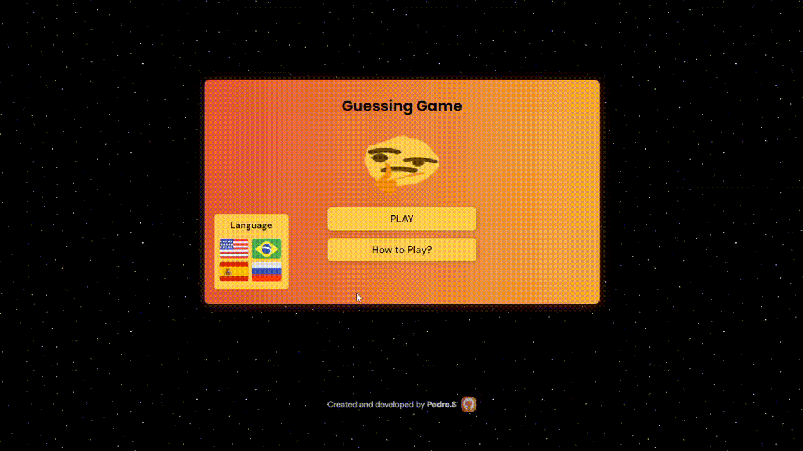

# Guessing Game 🤔🎮
 
 
 
<h3 align="center">Status: 🚀 Finished</h3>

 
  </img>
  </img>
  </img>

  

## 📒 About

**EN** =  This project is a guessing game developed with HTML, CSS, and JavaScript. The player must guess a number between 0 and 10, receiving immediate feedback and a scoring system based on the attempts needed to guess correctly. The game is multilingual, supporting Portuguese, English, Spanish, and Russian, providing an accessible experience for different audiences. Additionally, the interface is intuitive and user-friendly.

**PT** = Este projeto é um jogo de adivinhação desenvolvido com HTML, CSS e JavaScript. O jogador deve adivinhar um número entre 0 e 10, com feedback imediato e um sistema de pontuação com base nas tentativas necessárias para acertar. O jogo é multilíngue, suportando português, inglês, espanhol e russo, permitindo uma experiência acessível para diferentes públicos. Além disso, a interface é intuitiva e fácil de usar.

## 🛠️ Features

- **Multilingual:** Supports various languages, including *Portuguese*, *English*, *Spanish*, and *Russian*, making the game accessible to a broader audience.
- **Random Number Generation:** Generates random numbers between 0 and 10, challenging the player to guess the correct number.
- **Scoring System:** Provides a scoring system based on the number of attempts needed to guess the number.
- **Responsive Interface:** The game features a responsive interface that adapts to different screen sizes.
- **Mobile-First Design:** Designed with priority for mobile devices, ensuring an optimized gaming experience on smartphones and tablets.

 

## 💻 Layout Desktop | 📱 Layout mobile

- <a href="" target="_blank">**Click Here** &#x1F517;</a>

 

## 👨‍💻 Author
This project was developed by Pedro.S.